= Todo Serverless

== WARNING


This project is deployed on the AWS Cloud and like each Cloud service it could generate costs. Even when parts are covered by the https://aws.amazon.com/free/[AWS Free Tier] it is your responsibility to evaluate and survey costs that also may change over time.

While reading different documentations and forums, the following hint I found useful:

- Consider to use 2 way authenticated. (Be aware, hacker could use your account for example for crypto mining and generate high costs).

- Consider not to use your root account as working user, but to create a second account.

- Consider to create a Budget plan, even only to 1€, and receive a [NOTIFICATION-MAIL] when the limit is reached.

- Consider to remove all resources not needed or created for testing.

== Content

This project contains a POC implementation for an Serverless application. The following elements could be found in the project


* Makefile : scripts building and deploying the application

* SAM (template.yaml) containing the Cloud Formation definition for the AWS Serverless environment. it deploys

** 5 Lambda Functions build on Rust for the different GET/PUT/POST/DELETE operations

** A DynamoBB storing the data for the application

** An S3 Bucket with public access containing a static Web Site build on Leptos

** A CloudWatch group containing the logs of the application

** Api Gateway for CORS, Policies, Usage Plan,... to configure the elements

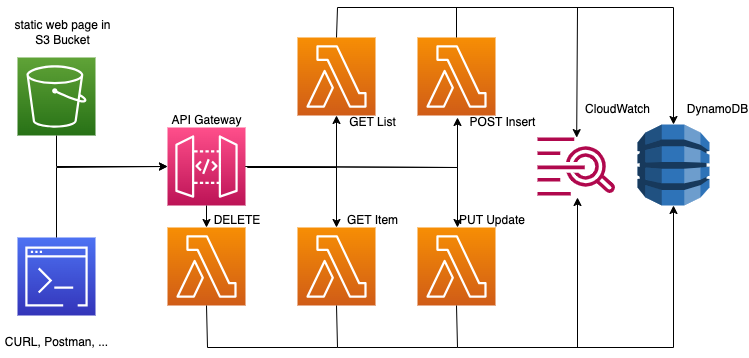

== Requirement

For deploying the application we need:

* an AWS account

* an AWS User with programmatic Access Keys for SAM.

* AWS SAM configured with the Access Keys for deploying the application

* a Rust development environment as the functions are build on Rust (Rust compiler and cargo)

* Trunk (WASM) for building the Rust Leptos Frontend

* A critical and open mind :smile: Don't simply copy/paste, this code it is more for inspiration and showcase. It works (on my pc :grin:)

== Deployment

The deployment is partially automated, this due the SAM that manages the serverless application and the scripts prepared in the Makefile.

Here the steps:

1) Modifying in the template.yaml file the bucket name. It must be unique on the cloud:

```
  S3Bucket:
    Type: AWS::S3::Bucket
    DeletionPolicy: Delete
    Properties:
      # REPLACE THIS NAME BY YOUR OWN BUCKET NAME !!!
      # APPLY ALSO THE NAME IN THE [MakeFile]:
      #   BUCKET_NAME := todo-app-xxx
      BucketName: todo-app-xxx
```

2) From Makefile the step: api

it compiles the lambda functions and deploys it to AWS with creating and configuring the AWS Serverless application, including Bucket and DynamoDB

3) On the end you get in the output the URL for the Lambda function. !!! ATTENTION !!! these entry points are public. So ANYBODY could, when known sent requests on it. The TodoUsagePlan and CORS would be some of the elements to consider for reducing risks.

```
2024-02-21 20:29:04 - Waiting for stack create/update to complete

CloudFormation events from stack operations (refresh every 5.0 seconds)
-------------------------------------------------------------------------------------------------
ResourceStatus           ResourceType             LogicalResourceId        ResourceStatusReason
-------------------------------------------------------------------------------------------------
CREATE_COMPLETE          AWS::Logs::LogGroup      TodoLogGroup             -
CREATE_COMPLETE          AWS::DynamoDB::Table     TodoDB                   -
CREATE_COMPLETE          AWS::IAM::Role           TodoExecutionRole        -
CREATE_COMPLETE          AWS::Lambda::Function    TodoEditItemFunction     -
CREATE_COMPLETE          AWS::Lambda::Function    TodoDeleteItemFunction   -
CREATE_COMPLETE          AWS::Lambda::Function    TodoAddItemFunction      -
CREATE_COMPLETE          AWS::Lambda::Function    TodoGetItemFunction      -
CREATE_COMPLETE          AWS::Lambda::Function    TodoGetListFunction      -
CREATE_COMPLETE          AWS::S3::Bucket          S3Bucket                 -
CREATE_COMPLETE          AWS::ApiGateway::RestA   ServerlessRestApi        -
CREATE_COMPLETE          AWS::S3::BucketPolicy    BucketPolicy             -
CREATE_COMPLETE          AWS::Lambda::Permissio   TodoDeleteItemFunction   -
CREATE_COMPLETE          AWS::Lambda::Permissio   TodoAddItemFunctionCat   -
CREATE_COMPLETE          AWS::Lambda::Permissio   TodoGetListFunctionCat   -
CREATE_COMPLETE          AWS::Lambda::Permissio   TodoGetItemFunctionCat   -
CREATE_COMPLETE          AWS::Lambda::Permissio   TodoEditItemFunctionCa   -
CREATE_COMPLETE          AWS::ApiGateway::Deplo   ServerlessRestApiDeplo   -
CREATE_COMPLETE          AWS::ApiGateway::Stage   ServerlessRestApiProdS   -
CREATE_COMPLETE          AWS::ApiGateway::Usage   TodoUsagePlan            -
CREATE_COMPLETE          AWS::CloudFormation::S   todo-app                 -

CloudFormation outputs from deployed stack
-------------------------------------------------------------------------------------------------
Outputs
-------------------------------------------------------------------------------------------------
Key                 TodoBucketUrl
Description         S3 Bucket URL:
Value               https://XXXXXXXXXXXXXXXXX.s3.eu-west-1.amazonaws.com

Key                 TodoGetListFunctionAPI
Description         API [get-todos] URL:
Value               https://XXXXXXXXXXXXXXXXX.execute-api.eu-west-1.amazonaws.com/Prod/get-todos
```

The points could already be used by CURL or in the folder http some scripts, if you use IntelliJ Ultimate.

4) Before building the Frontend, we need to modify the URL on to access on the API entry points. In todo_ui/src/components/todo_service.rs replace the URL:

```
TodoService {
    url: "https://XXXXXXXXXXXXXXXXX.execute-api.eu-west-1.amazonaws.com/Prod/".to_string()
}
```

Also replace in the Makefile the Bucket for publishing the static files:

```
STACK_NAME ?= todo-app
FUNCTIONS := get-todos
BUCKET_NAME := todo-demo-xxx
```

5) From the Makefile you can now executing the step: ui that build and deploys the web components in the S3 Bucket. !!! ATTENTION !!!The same here, the URL is public accessible.

6) Accessing the application from the Bucket URL, you find it in the logs of the SAM deployment (https://XXXXXXXXXXXXXXXXX.s3.eu-west-1.amazonaws.com)

*CLEAN UP*

When you are finished, you can remove the resources with the step clean in Makefile. Validate the logs, and ensure that all resources have been deleted in connecting to the AWS console.

== Components

Let take a look on the different components created:

=== S3 Bucket

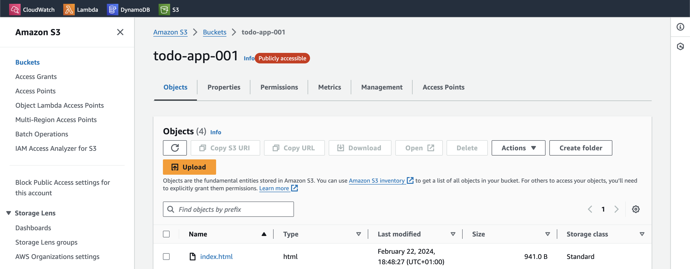

In the S3 Bucket we would find the uploaded files (HTML, JS, CSS) that forms the static web page.

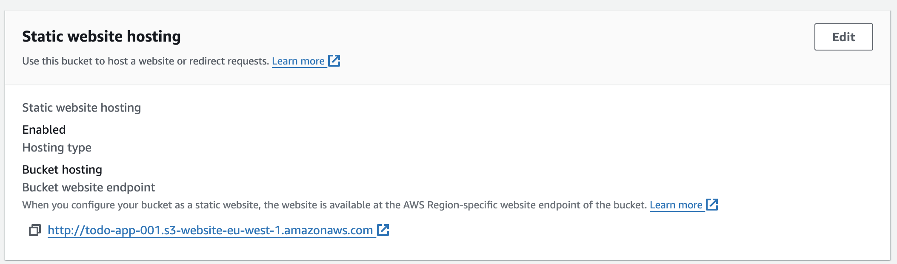

Looking on the properties, we would also find here the URL to access the application by a web browser.

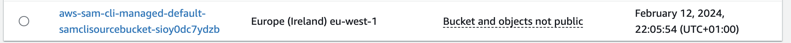

You see also a bucket containing the Cloud Formation template uploaded with the SAM commands from Makefile. A link to S3 pricing: https://aws.amazon.com/s3/pricing/

=== Cloud Formation

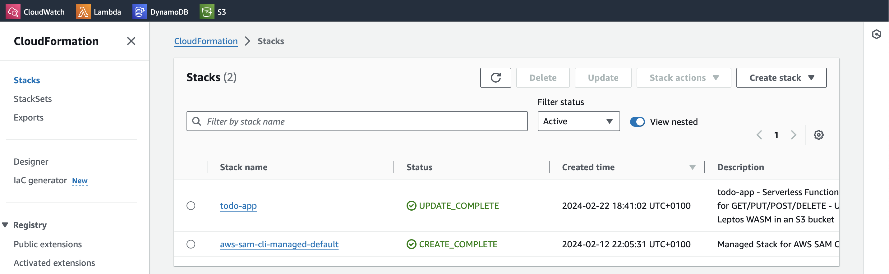

It provides the Todo project description. it could be modified inside AWS, but the changes would not be at that time on your template.yaml

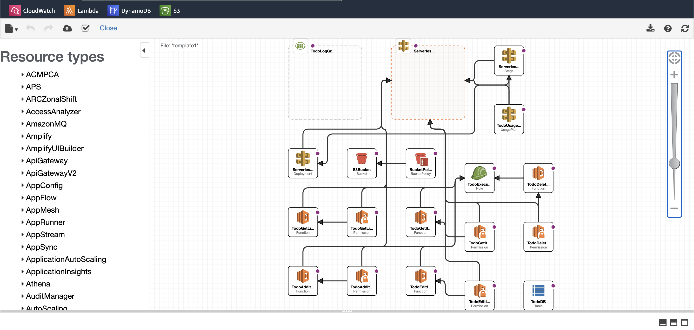

You can also access it with the visual editor to look and modify elements.

=== AWS Lambda

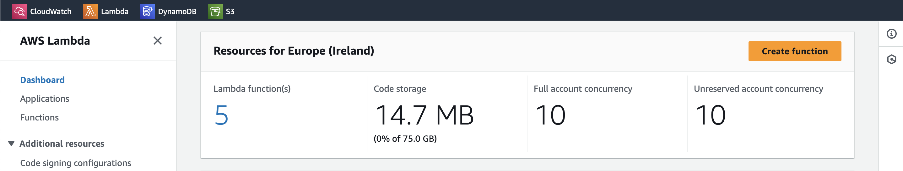

On the AWS Lambda screen, we see the currently number of Lambda's installed. to mention, we see the current 5 Lambda's only use 15 MB (3MB per Lambda). One advantage of Rust Lambda's, they are compact.

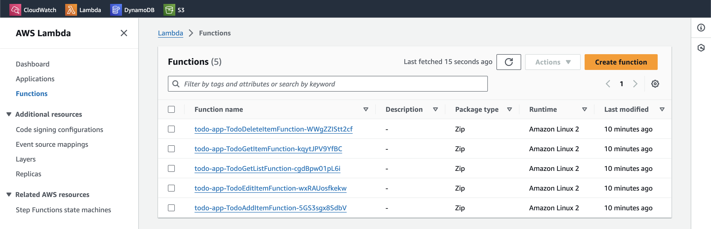

In details, we see the lambda's. As we see, the names would change each time you clean and install your SAM, but not when updating a SAM Project. A link to Lambda pricing: https://aws.amazon.com/lambda/pricing/

=== DynamoDB

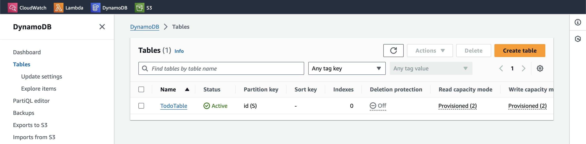

The DynamoDB created and storing the Todo's of the application. A link to the Dynamo pricing: https://aws.amazon.com/dynamodb/pricing/

=== Cloud Watch

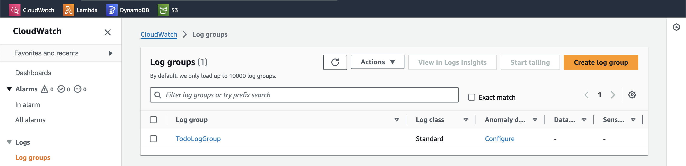

In Cloud Watch the generated Log Group

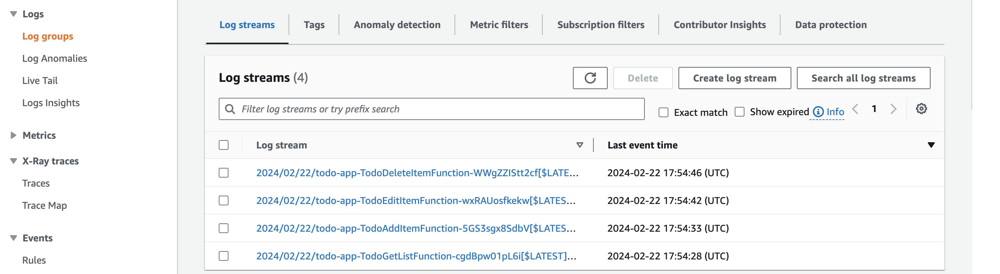

Containing for each function a group of logs

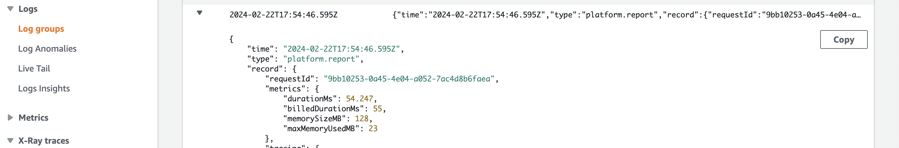

and looking on the log entry, we see the memory and billing duration defining the costs of this single execution. Here also we see 55ms with an allocation of 128MB Memory is competitive. A link to Cloudwatch pricing: https://aws.amazon.com/cloudwatch/pricing/

=== API Gateway

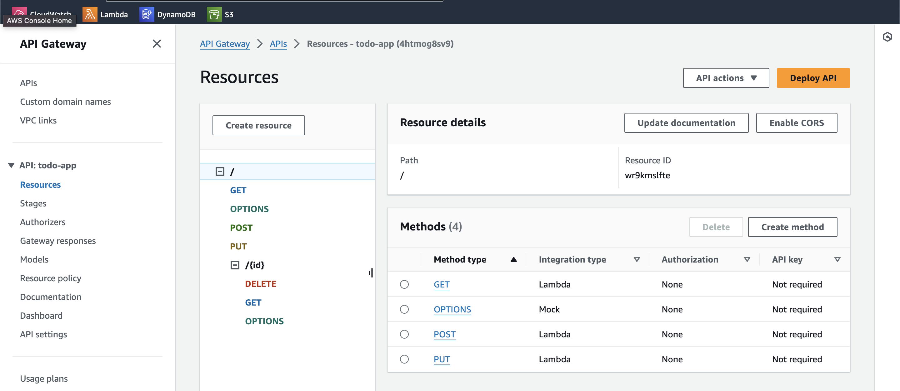

For the last, take a look on the API Gateway showing the different entry points, linked to the different Lambda functions, and also containing the CORS definition. The API Gateway will also generate costs, see: https://aws.amazon.com/api-gateway/pricing/[]

== Conclusion

This sample was for me the continuation of my Todo series, on Serverless. After the implementation:

* Serverless is not a silver bullet, it is one of many ways to solve a problem. Analyse the problem and choose the right tool. But learning new tools, to know about your options.

* I think I would on a real project favorite CDK (with TypeScript) over SAM for creating and deploying the Cloud Formation. I used AWS Code Whisperer to support me on creating the template.yaml, with TypeScript I would be supported by auto-complete by my IDE.

* The Frontend part I would not store on S3 but looking for solutions to avoid the CORS problems. Also in mindset that Leptos provide a better solution with server side rendering.

* I will keep my researches and studies with Rust as language for Lambda's. But today already a lot of Lambda functions are written in other languages and these also search for solutions to reduce the cold start and to reduce costs. So your Serverless journey is not bound to a language and keep an eye on projects like https://github.com/awslabs/llrt[LLRT].

== Disclaimer

This GitHub project is experimental application for education purpose. It's important to acknowledge that cloud services could generate costs based on usage, configuration, and external factors.

By accessing and utilizing this project, you agree that:

    Cost Management Responsibility: You are responsible for monitoring and managing the costs associated with deploying and running this application in your own cloud environment. This includes understanding the pricing structure of the cloud service provider and making informed decisions to optimize costs.

    Usage and Deployment: You acknowledge that the usage and deployment of this application may result in charges from the cloud service provider. It's essential to review and comprehend the pricing details provided by the cloud service provider before deploying the application.

    No Liability: The creators and contributors of this project are not liable for any costs incurred as a result of deploying, running, or modifying this application. This includes, but is not limited to, charges accrued from cloud services, unexpected usage spikes, or misconfigurations.

    Best Practices and Recommendations: We strongly recommend implementing cost management best practices, such as setting up budget alerts, utilizing cost-effective resources, and regularly reviewing usage reports to avoid unexpected expenses.

    Continuous Monitoring: It's your responsibility to continuously monitor the usage and costs associated with running this application. Periodic reviews of cloud billing statements and resource utilization are essential to ensure cost-effectiveness.

    Feedback and Contributions: We welcome feedback and contributions to enhance the efficiency and cost-effectiveness of this project. However, any changes made to optimize costs should be thoroughly tested to ensure they do not compromise the functionality or security of the application.

By proceeding with the usage of this project, you acknowledge that you have read, understood, and agreed to the terms outlined in this disclaimer. If you do not agree with these terms, refrain from accessing or utilizing this project.